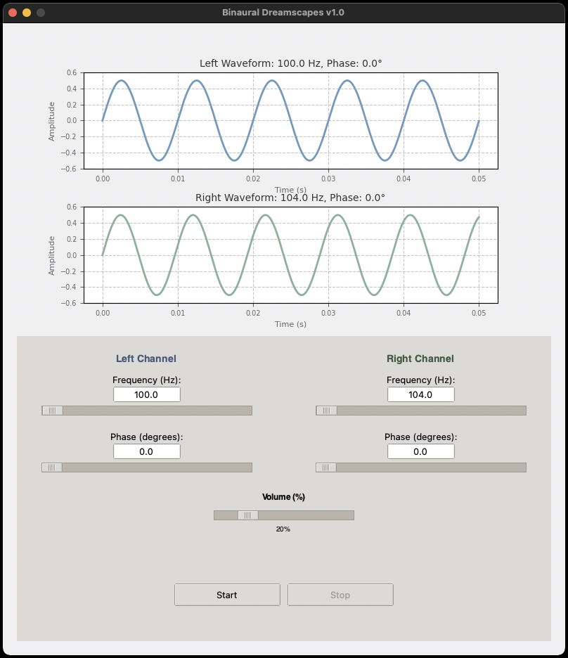
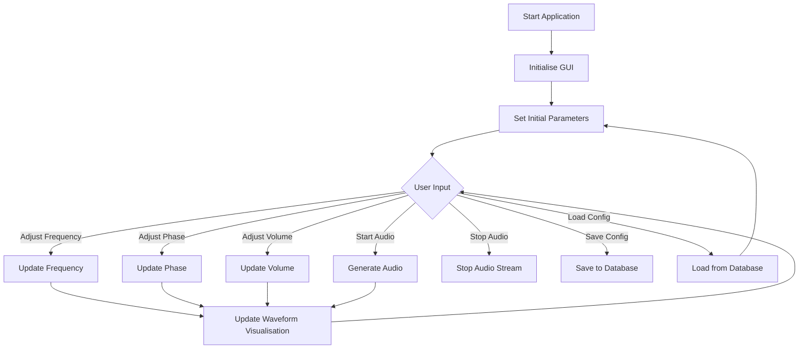
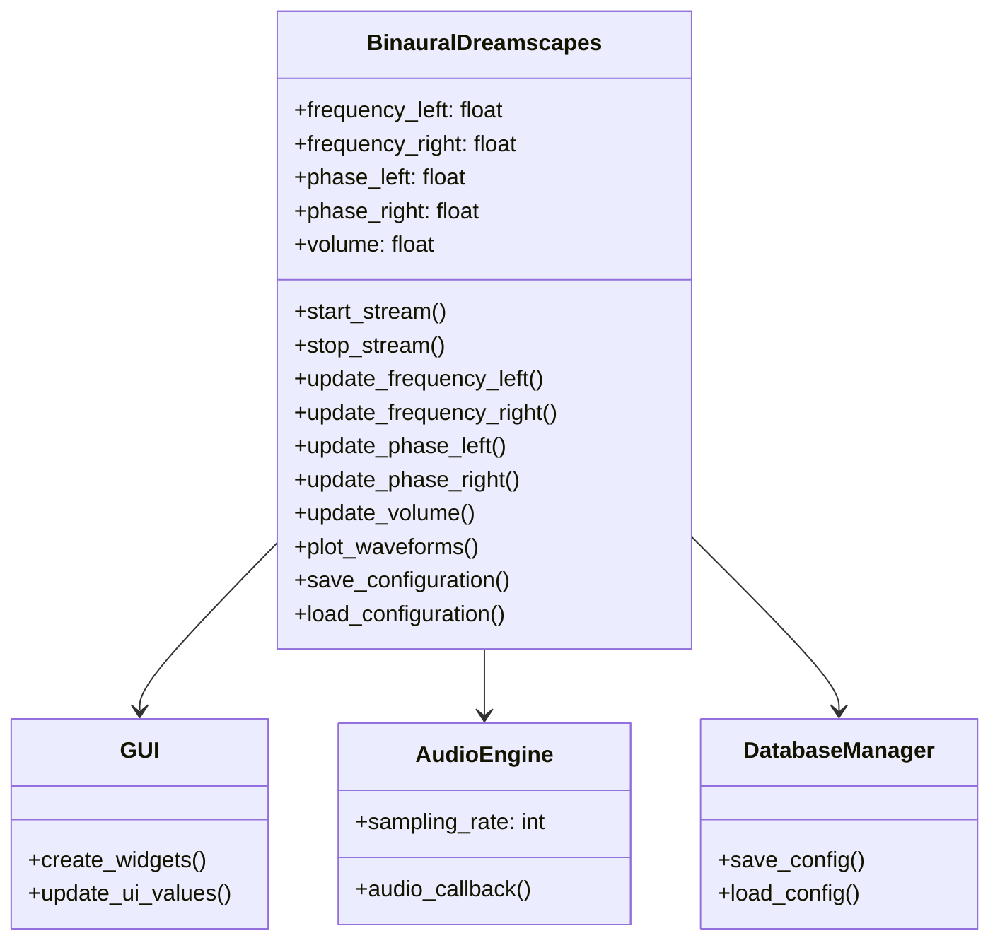

# Binaural Dreamscapes

An interactive tool for creating and visualising binaural audio waves for meditation and astral travel.

## Description

Binaural Dreamscapes is a powerful and intuitive application designed for crafting binaural audio experiences tailored for meditation and astral travel. This interactive tool allows users to adjust and visualise dual sine wave frequencies and phases in real-time, offering a seamless way to create immersive soundscapes. With its user-friendly interface, you can manipulate audio parameters and observe their effects on dynamic waveforms, making it an ideal companion for exploring altered states of consciousness and enhancing your meditative practice.



## Features

- Real-time adjustment of left and right audio frequencies (1-20000 Hz)
- Phase control for left and right channels (0-360 degrees)
- Volume control (0-100%)
- Live waveform visualisation
- Start/Stop audio playback
- Update all parameters simultaneously
- Save and load custom configurations
- About and Help dialogs

## Application Workflow



## Application Structure



## Installation

1. Ensure you have Python 3.7 or later installed on your system.
2. Clone this repository or download the source code.
3. Navigate to the project directory in your terminal.
4. Install the required dependencies by running:
   ```
   pip install -r requirements.txt
   ```

## Usage

1. Launch the application by running:
   ```
   python app.py
   ```
2. Adjust the frequencies and phases using the sliders or text inputs
3. Set the desired volume using the volume slider
4. Click "Start" to begin audio playback
5. Observe the live waveform visualisation
6. Click "Stop" to end audio playback
7. Use the File menu to save or load configurations

## TODO

- [x] Implement save/load configuration functionality
- [x] Live waveform visualisation
- [x] Add About and Help dialogs
- [ ] Add frequency sweep feature
- [ ] Incorporate amplitude control
- [ ] Develop advanced waveform options (square, triangle, etc.)
- [ ] Create binaural beat presets
- [ ] Integrate a sound spectrum analyser
- [ ] Add multi-language support
- [ ] Expand the help section
- [ ] Incorporate accessibility features
- [ ] Ensure cross-platform compatibility

## Contributing

Contributions to Binaural Dreamscapes are welcome. Please feel free to submit a Pull Request.

## License

Copyright (c) 2024 Captain Code. All rights reserved.
